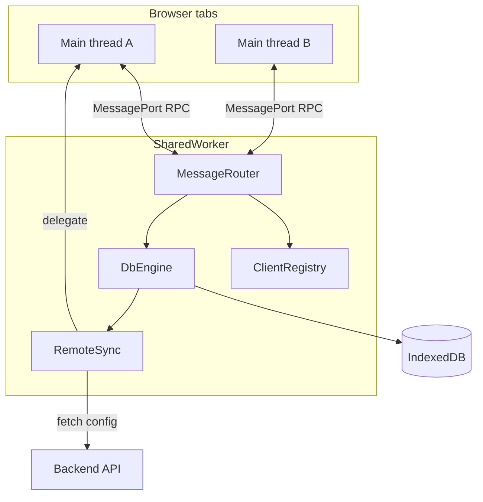

# worker-sync-db

Typed IndexedDB inside a **SharedWorker** with multi-tab subscriptions and offline-first remote sync.

## Features

- **SharedWorker** — one database process per `dbName` on your origin
- **IndexedDB** — persistent storage with schema-defined collections
- **TypeScript** — typed `get` / `put` / `query` / `subscribe`
- **Multi-tab** — mutations fan-out to all connected tabs via `ClientRegistry`
- **Remote sync** — offline queue with delegate (main thread) or fetch (worker) adapters
- **Fallback** — `DedicatedWorker` when `SharedWorker` is unavailable (`mode: 'auto'`)

## How it works



Each tab calls `createDatabase()` and talks to the same SharedWorker (keyed by `dbName`). Writes go to IndexedDB immediately; other tabs receive `subscribe` events. Remote sync runs once inside the worker.

See [docs/architecture.md](docs/architecture.md) for protocol and component details.

## Install

```bash
npm install worker-sync-db
```

## Quick start

```typescript
import { createDatabase, sharedWorkerUrl, dedicatedWorkerUrl } from 'worker-sync-db';

const schema = {
  todos: {
    keyPath: 'id',
    indexes: { byStatus: 'status' },
  },
} as const;

const db = await createDatabase({
  schema,
  dbName: 'my-app',
  sharedWorker: sharedWorkerUrl,
  dedicatedWorker: dedicatedWorkerUrl,
  mode: 'auto',
  remote: {
    async pull(cursor) {
      const res = await fetch(`/api/sync/pull?cursor=${cursor ?? ''}`);
      return res.json();
    },
    async push(ops) {
      const res = await fetch('/api/sync/push', {
        method: 'POST',
        headers: { 'Content-Type': 'application/json' },
        body: JSON.stringify({ ops }),
      });
      return res.json();
    },
  },
});

await db.put('todos', { id: '1', title: 'Buy milk', status: 'open' });

const unsub = db.subscribe('todos', (e) => {
  if (e.type === 'put') console.log(e.doc);
});

await db.syncNow();
```

**React demo:** [examples/vite-react-todos](examples/vite-react-todos) — todos app with hooks, mock sync, multi-tab banner.

```bash
npm run example:dev
# or: cd examples/vite-react-todos && npm install && npm run dev
```

## Collection schema

Define stores once; TypeScript infers collection names from `schema`:

```typescript
const schema = {
  todos: {
    keyPath: 'id',
    indexes: { byStatus: 'status' },
  },
} as const;
```

Every stored document includes metadata:

| Field | Description |
|-------|-------------|
| `id` | Primary key (from your payload) |
| `_version` | Monotonic version, incremented on each write |
| `_updatedAt` | `Date.now()` at write time |
| `_deleted` | Soft delete flag (optional) |

Schema changes bump the IndexedDB version automatically (`computeSchemaVersion`). All tabs must use the **same** schema for a given `dbName`, or connect fails with `SchemaMismatch`.

Details: [docs/getting-started.md](docs/getting-started.md)

## API overview

| Method | Description |
|--------|-------------|
| `get(collection, id)` | Load one document (null if missing or soft-deleted) |
| `put(collection, doc)` | Upsert; returns doc with meta fields |
| `delete(collection, id)` | Soft-delete |
| `query(collection, opts?)` | List by store or index + optional `IDBKeyRange` |
| `subscribe(collection, listener, filter?)` | Live updates (local + remote pull + other tabs); optional field filter |
| `syncNow()` | Push pending ops, pull remote changes |
| `getSyncStatus()` | `{ pending, lastSyncAt, lastError, online }` |
| `onSyncStatusChange(listener)` | Fired when sync status changes |
| `close()` | Disconnect port and send `disconnect` |

Full reference: [docs/api.md](docs/api.md)

## Worker modes

| `mode` | Behavior |
|--------|----------|
| `'auto'` (default) | SharedWorker if available, else Dedicated Worker |
| `'shared'` | Require SharedWorker (throws if unsupported) |
| `'dedicated'` | One Worker per tab; no cross-tab fan-out |

```typescript
import { isSharedWorkerSupported, resolveWorkerMode } from 'worker-sync-db';

if (!isSharedWorkerSupported()) {
  console.warn('Using dedicated worker fallback');
}
```

## Remote sync

Two options:

1. **Delegate (recommended for custom logic)** — pass `remote: { pull, push }` functions. They run on the **leader tab** main thread (functions cannot be cloned into the worker).
2. **Fetch config** — pass `remote: { pullUrl, pushUrl, headers? }`. HTTP runs entirely inside the SharedWorker.

Offline-first: `put` / `delete` write to IndexedDB and enqueue ops immediately; `syncNow()` (also triggered after mutations) pushes then pulls.

See [docs/sync.md](docs/sync.md).

```typescript
// Fetch-based (no functions in worker)
const db = await createDatabase({
  schema,
  dbName: 'my-app',
  remote: {
    pullUrl: '/api/sync/pull',
    pushUrl: '/api/sync/push',
    headers: { Authorization: 'Bearer …' },
  },
});

// Conflict callback (delegate push conflicts)
const db = await createDatabase({
  schema,
  dbName: 'my-app',
  remote: myAdapter,
  onConflict: ({ opId, reason }) => console.warn(opId, reason),
});
```

## Bundler setup

You must pass explicit URLs so the bundler emits separate worker chunks:

```typescript
import { sharedWorkerUrl, dedicatedWorkerUrl } from 'worker-sync-db';
// passed to createDatabase, or omitted (same defaults)
```

Vite, Webpack, and monorepo notes: [docs/bundlers.md](docs/bundlers.md)

## Package exports

| Import | Description |
|--------|-------------|
| `worker-sync-db` | Client API (`createDatabase`, types) |
| `worker-sync-db/react` | React hooks (`useQuery`, `useSubscribe`, `useSyncStatus`, `DatabaseProvider`) |
| `worker-sync-db/shared-worker` | SharedWorker entry bundle |
| `worker-sync-db/dedicated-worker` | Dedicated worker entry bundle |

## React

```typescript
import { DatabaseProvider, useQuery, useSyncStatus } from 'worker-sync-db/react';

const { data, loading } = useQuery(db, 'todos');
const status = useSyncStatus(db);
```

See [docs/react.md](docs/react.md).

## Live demo (GitHub Pages)

After Pages is enabled for this repo, the demo is at:

**https://profyt.github.io/jubilant-journey/**

Deploy workflow: [`.github/workflows/pages.yml`](.github/workflows/pages.yml) (builds `examples/vite-react-todos` on push to `main`).

**One-time setup:** GitHub → **Settings → Pages → Source: GitHub Actions**. Until that is selected, the workflow uploads an artifact but cannot publish a public URL.

Locally: `npm run build && npm run example:dev`.

## Publishing to npm

Package is publish-ready (`exports`, `files`, `LICENSE`, `CHANGELOG`, `prepublishOnly`). Exact commands: [docs/publishing.md](docs/publishing.md).

```bash
npm run prepublishOnly
npm publish --access public
```

## Documentation

| Guide | Topics |
|-------|--------|
| [getting-started.md](docs/getting-started.md) | Install, schema, first app |
| [api.md](docs/api.md) | Full API reference |
| [react.md](docs/react.md) | React hooks |
| [sync.md](docs/sync.md) | Push/pull, leader tab, backend contract |
| [bundlers.md](docs/bundlers.md) | Vite / Webpack configuration |
| [architecture.md](docs/architecture.md) | Components, RPC protocol |
| [troubleshooting.md](docs/troubleshooting.md) | Common errors, DevTools |
| [publishing.md](docs/publishing.md) | npm publish checklist |

## Limitations (v1)

- No CRDT / field-level merge — conflicts use LWW on `_updatedAt` / `_version`
- Dedicated worker: single-tab only (no fan-out)
- Remote functions only via delegate on main thread
- No built-in auth refresh (implement in `RemoteSyncAdapter`)
- `createDatabase` requires browser (`window`); not for SSR

## Scripts

```bash
npm run build
npm run typecheck
npm test
npm run example:dev   # React todos demo
```

## License

MIT
