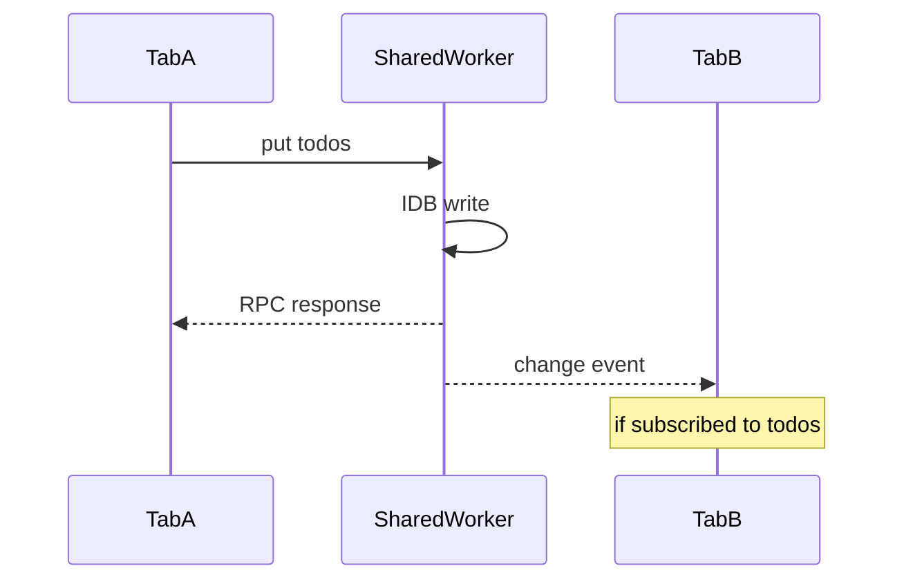

# Architecture

## Components

| Component | Location | Role |
|-----------|----------|------|
| `createDatabase` | `src/client/createDatabase.ts` | Public API, wraps `PortBridge` |
| `PortBridge` | `src/client/PortBridge.ts` | RPC + events on `MessagePort` |
| `SharedWorkerBridge` | `src/client/SharedWorkerBridge.ts` | `new SharedWorker()` + connect |
| `MessageRouter` | `src/shared-worker/MessageRouter.ts` | Request dispatch |
| `ClientRegistry` | `src/shared-worker/ClientRegistry.ts` | Port map, subscriptions, fan-out |
| `DbEngine` | `src/shared-worker/DbEngine.ts` | IndexedDB CRUD |
| `RemoteSync` | `src/shared-worker/RemoteSync.ts` | Push/pull loop |

Dedicated worker reuses the same router/engine via an internal `MessageChannel` (`src/dedicated-worker/entry.ts`).

## Multi-tab fan-out



`ClientRegistry` stores per-port subscriptions. `broadcastChange` posts `{ kind: 'change', collection, type, doc, id }` only to clients subscribed to that collection.

## RPC protocol

Requests (main → worker):

```typescript
{ requestId: string, type: 'connect' | 'get' | 'put' | ... , ...payload }
```

Responses (worker → main):

```typescript
{ kind: 'response', requestId, ok: true, data }
{ kind: 'response', requestId, ok: false, error: DbError }
```

Events (worker → main, no `requestId`):

```typescript
{ kind: 'change', collection, type, doc, id }
{ kind: 'syncStatus', status }
{ kind: 'sync:pull', requestId, cursor }  // to leader tab only
{ kind: 'sync:push', requestId, ops }
```

Leader tab replies:

```typescript
{ kind: 'sync:pull:result', requestId, changes, nextCursor }
{ kind: 'sync:push:result', requestId, applied, conflicts? }
```

Full types: `src/shared/protocol.ts`.

## IndexedDB layout

For schema `{ todos: { keyPath: 'id' } }`:

| Store | Purpose |
|-------|---------|
| `todos` | User collections |
| `_meta` | Sync cursor key-value |
| `sync_queue` | Pending `PendingOp` records |

## Schema versioning

`computeSchemaVersion(schema)` hashes collection names, key paths, and indexes into an integer used as IndexedDB `version`. Changing the schema triggers `upgrade` and creates new indexes/stores.

All tabs connecting to the same `dbName` must use an identical schema JSON shape or `connect` returns `SchemaMismatch`.

## Leader election

On `connect` with `syncCapable: true` (set when `remote` adapter is provided):

1. First capable client becomes sync leader.
2. `RemoteSync` sends `sync:pull` / `sync:push` only to the leader port.
3. If leader disconnects, the next `syncCapable` client is promoted.

Fetch-mode sync does not need a leader for HTTP, but still uses one less port for delegate compatibility when mixing modes is not supported.
