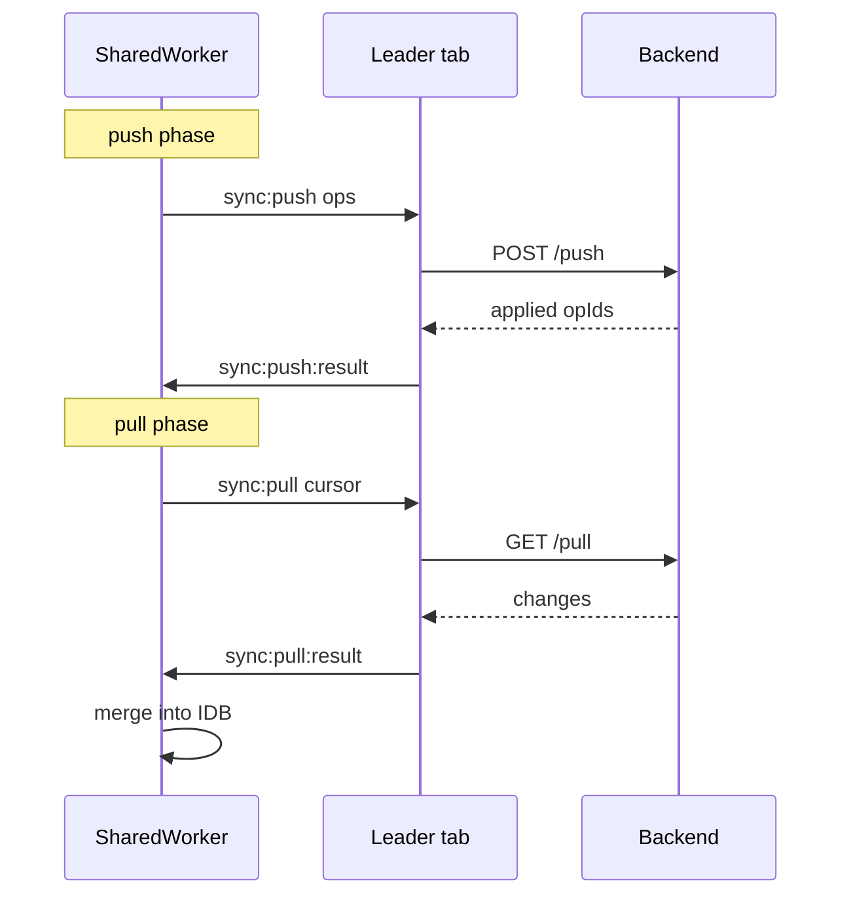

# Remote sync

## Overview

worker-sync-db uses an **offline-first** model:

1. `put` / `delete` write to IndexedDB immediately.
2. Each mutation is appended to `_meta/sync_queue` as a `PendingOp`.
3. `syncNow()` (also scheduled after writes) pushes pending ops, then pulls remote changes.
4. Remote changes merge with **LWW** (last write wins) using `_updatedAt` and `_version`.

## Delegate vs fetch



### Delegate mode (`RemoteSyncAdapter`)

Use when you need custom auth, retries, or non-REST protocols.

```typescript
const db = await createDatabase({
  schema,
  dbName: 'my-app',
  sharedWorker: new URL('worker-sync-db/shared-worker', import.meta.url),
  remote: {
    async pull(cursor) {
      const res = await fetch(`/api/sync/pull?cursor=${cursor ?? ''}`);
      return res.json();
    },
    async push(ops) {
      const res = await fetch('/api/sync/push', {
        method: 'POST',
        headers: { 'Content-Type': 'application/json' },
        body: JSON.stringify({ ops }),
      });
      return res.json();
    },
  },
  onConflict: ({ opId, reason }) => {
    console.warn('Conflict', opId, reason);
  },
});
```

Functions run on the **leader tab** (first connected tab with `syncCapable: true`). Other tabs only receive `SyncStatus` broadcasts.

### Fetch mode (`FetchSyncConfig`)

Use for simple REST endpoints without custom client logic.

```typescript
remote: {
  pullUrl: '/api/sync/pull',
  pushUrl: '/api/sync/push',
  headers: { Authorization: `Bearer ${token}` },
}
```

HTTP runs inside the SharedWorker via `fetch()`.

## Backend contract

### Push request body

```json
{
  "ops": [
    {
      "opId": "uuid",
      "collection": "todos",
      "kind": "put",
      "doc": {
        "id": "1",
        "title": "Milk",
        "status": "open",
        "_version": 2,
        "_updatedAt": 1717000000000
      }
    }
  ]
}
```

### Push response

```json
{
  "applied": ["opId-1", "opId-2"],
  "conflicts": [{ "opId": "opId-3", "reason": "version mismatch" }]
}
```

Applied `opId`s are removed from the local queue. Optional `conflicts` trigger `onConflict` on the leader tab (delegate mode).

### Pull response

```json
{
  "changes": [
    {
      "collection": "todos",
      "kind": "put",
      "doc": {
        "id": "1",
        "title": "Milk",
        "status": "done",
        "_version": 3,
        "_updatedAt": 1717000001000
      }
    }
  ],
  "nextCursor": "cursor-token-or-null"
}
```

`nextCursor` is stored in IndexedDB meta and sent on the next pull.

## Mock adapter (example app)

The React example uses an in-memory adapter with artificial delay — see [examples/vite-react-todos/src/sync/mockAdapter.ts](../examples/vite-react-todos/src/sync/mockAdapter.ts).

## SyncStatus

Subscribe for UI indicators:

```typescript
db.onSyncStatusChange((status) => {
  console.log(status.pending, status.online, status.lastError);
});

await db.syncNow();
```

| Field | Meaning |
|-------|---------|
| `pending` | Ops waiting in sync queue |
| `lastSyncAt` | Timestamp of last successful sync |
| `lastError` | Last error message or null |
| `online` | `navigator.onLine` in worker |
